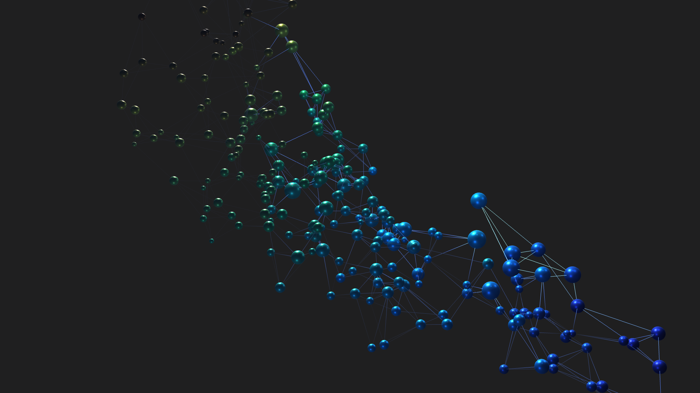

# Seeing Birdsong

Turn any audio (birdsong, music, …) into a **3D "map of sound"**: each short
segment of the recording becomes a glowing node, positioned by its acoustic
character, connected into a network, and lit up in sync with playback.

Inspired by Lucio Arese's *Seeing Birdsong*. This is an independent
re-implementation built around a transparent, **interpretable descriptor space**
(the axes are named spectral descriptors — not a black-box embedding).



---

## What it does

```
audio ─▶ segment ─▶ spectral descriptors ─▶ 3D placement ─▶ color / size / glow ─▶ render
        (onset)     (centroid, spread,        (3 chosen          (centroid → hue,
                     crest, flux, …)           descriptors        amplitude → size,
                                               = X / Y / Z)       playback → glow)
```

- **Segment** the recording into syllables/notes (onset detection).
- **Measure** ~16 spectral descriptors per segment (spectral centroid, spread,
  crest, flatness, contrast, slope, flux, rolloff, dominant freq, F0,
  centroid–F0 gap, tonality, HNR, amplitude, …).
- **Place** each segment in 3D using three chosen descriptors as the X/Y/Z axes
  (default: spread × centroid × crest). Because the axes are real descriptors,
  the layout is explainable. A UMAP variant is also provided for automatic
  structure discovery.
- **Map** the remaining channels to visuals: color = spectral centroid,
  size = amplitude, edges = nearest neighbours, and a **glow that follows the
  playhead** (each node flashes when its segment sounds, with an attack burst).

It works on **any audio** — the included samples are synthetic test tones, and
it has been tried on solo/chamber classical recordings as well.

---

## Front-ends

There are two ways to view the result:

1. **Web (no install beyond Python)** — interactive HTML viewers:
   - `viewer.html` — three.js scene (glowing nodes + edges, click a node to play
     that segment, timeline-synced playback).
   - `birdsong.html` — Plotly 3D scatter (UMAP manifold).
   - `descriptor_space.html` — Plotly 3D scatter with **dropdowns to pick which
     descriptor goes on each axis / color** (the "Timbre Space" view).
2. **TouchDesigner** — `td/NHK2026_3Dtest.toe`, a ready-to-open project with
   instanced spheres, bloom, environment lighting, a follow camera + an orbiting
   overview camera, audio playback, and an on-screen **control panel** (see GUI
   below). Authored in TouchDesigner 2025.30060.

---

## Quick start

### 1. Install (Python 3.11 recommended)

```bash
python3.11 -m venv venv
./venv/bin/pip install -r requirements.txt
```

### 2. Generate the data

```bash
# segment + features + UMAP + clusters  ->  out/td_points.csv, scene.json, viewer.html, ...
./venv/bin/python pipeline.py --audio audio --out out

# replace node positions with interpretable descriptor axes + color/size/labels
cp out/td_points.csv out/td_points_umap_backup.csv
./venv/bin/python td_descriptor_coords.py \
    --points out/td_points_umap_backup.csv --audio audio \
    --axes spread,centroid,crest --color centroid --out out

# (optional) configurable descriptor-space dashboard
./venv/bin/python descriptor_space.py --audio audio --out out
```

Use your own audio by dropping files into `audio/` (wav/flac/mp3/m4a/…).

### 3a. View in the browser

```bash
cd out && python3 -m http.server 8731
# open http://localhost:8731/viewer.html  (or birdsong.html / descriptor_space.html)
```
(Serving over HTTP is required — `file://` is blocked by the browser for fetch/audio.)

### 3b. View in TouchDesigner

Open `td/NHK2026_3Dtest.toe`. It reads `out/td_points.csv` / `td_edges.csv` and
the audio. To load a fresh dataset (after re-running the Python step), the project
has a one-shot refresh: in the TouchDesigner textport run
`mod('/seeing_birdsong/td_refresh').refresh()` (reload tables → recenter →
re-frame the overview camera → re-cook).

---

## GUI (TouchDesigner)

Select the `seeing_birdsong` component and open its parameters → **Controls**
page (also available as an on-screen `gui` panel inside the component):

| Control | Effect |
|---|---|
| Node Size | base sphere size |
| Line Thickness | edge ribbon width |
| Density | overall cloud scale (higher = packed tighter) |
| Glow | bloom intensity |
| Edge Opacity | edge line opacity |
| BG Brightness | background grey level |
| Orbit Speed | overview-camera rotation speed |

---

## Video export (32:9, with audio)

The repo includes a deterministic export flow used to render a side-by-side
**follow-camera | overview-camera** video at 3840×1080 with synced audio:
render each frame for an explicit time `T` to a PNG sequence, then mux with the
source audio via `ffmpeg`:

```bash
ffmpeg -framerate 30 -i out/frames/f%04d.png -i audio/your.wav \
    -c:v libx264 -pix_fmt yuv420p -crf 18 -c:a aac -shortest out/seeing_birdsong_32x9.mp4
```

(See `docs/DEV_NOTES_ja.md` for the frame-writer details. Real-time recording in
TouchDesigner desyncs A/V because it cooks faster than wall-clock, so the
frame-sequence + ffmpeg route is used instead.)

---

## Files

```
pipeline.py             segment → features → UMAP → clusters; writes TD/web data
td_descriptor_coords.py descriptor axes → 3D coords (+ color / amplitude / labels)
descriptor_space.py     per-frame descriptor dashboard (configurable-axis 3D scatter)
viewer.html             three.js viewer (glow + click-to-play + timeline)
td/NHK2026_3Dtest.toe    TouchDesigner project
audio/                  sample input (synthetic test tones)
docs/DEV_NOTES_ja.md    detailed build notes (Japanese)
```

---

## Credits & licensing

- Concept inspiration: **Lucio Arese — *Seeing Birdsong*** (independent
  re-implementation; not affiliated).
- Included sample audio (`audio/synthetic_*.wav`) is procedurally generated.
- The classical demo used a US-public-domain 1921 recording (Fritz Kreisler /
  Carl Lamson, "To Spring", from the Internet Archive Great 78 Project); it is
  **not** included here — bring your own audio.
- Code: MIT (see `LICENSE`).
